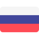

## Hi there👋

## 🙋 About me 🍙

I'm originally from Ukraine and of Hungarian descent. I'm a software developer who started my career as a sushi chef 🍣, working at Nobu London, where I honed my skills in precision, creativity, and adaptability.
However, in 2017, I boldly decided to transition into the world of software development—a field that had always intrigued me.

Since 2019, I've been working as a software engineer 💻, and over time, my passion for machine learning has only grown stronger. I love exploring new technologies, solving challenging problems, and continuously pushing my limits.

<!-- 
-->

## 🚀 I’m currently working on

I’m actively working on expanding my ML/AI skills by building multiple pet projects.<!-- which you can check out in my [portfolio](https://danielszakacs.github.io/my_portfolio/).-->

My goal is to deepen my understanding of data science, deep learning, and model deployment through hands-on experimentation and real-world problem-solving.

Beyond ML, I’ve always enjoyed working on side projects, especially Chrome extensions. In the past, I created:

- [Tab Saver - Bookmark](https://chromewebstore.google.com/detail/tab-saver-bookmark/akoelkdffpbphokikhegnneomleldhfo?authuser=0&hl=hu) – A simple yet effective tool I built to solve my problem of managing too many open tabs.
- [Salah - Prayer Reminder](https://chromewebstore.google.com/detail/salah-prayer-reminder/eglgbgmahngnflijjdhghhdbflgdceif?authuser=0&hl=hu) – Initially a hobby project, currently with **1 577+ downloads**!

<!--

-->
## 🌱 I’m currently learning

I'm diving into Data Engineering and Machine Learning, learning on my own and through online platforms like [DataCamp](https://www.datacamp.com/portfolio/danielszakacsit).
I'm also studying Business Informatics at university.

<!--## ♟️ Hobby 
In my free time, I enjoy playing chess as a hobby.
Feel free to challenge me on [Chess.com!](https://www.chess.com/member/daniel_szh)

<!--As a hobby, I love learning languages—currently German and Russian. -->
<!-- I’ve even passed the [HSK2](https://www.chinesetest.cn/HSK) exam in Chinese! ⭐ -->

<!--  -->
<!-- Icons are from here: https://www.freepik.com/search?format=search&iconType=standard&last_filter=query&last_value=russia&query=russia&type=icon -->
<!---->
<!---->

<!--## 📈 GitHub Stats 

-->

<!--

-->

<!-- 
&nbsp;
 -->

<!--  -->

<!--
**DanielSzakacs/danielszakacs** is a ✨ _special_ ✨ repository because its `README.md` (this file) appears on your GitHub profile.

Here are some ideas to get you started:

- 🔭 I’m currently working on ...
- 🌱 I’m currently learning ...
- 👯 I’m looking to collaborate on ...
- 🤔 I’m looking for help with ...
- 💬 Ask me about ...
- 📫 How to reach me: ...
- 😄 Pronouns: ...
- ⚡ Fun fact: ...
-->
